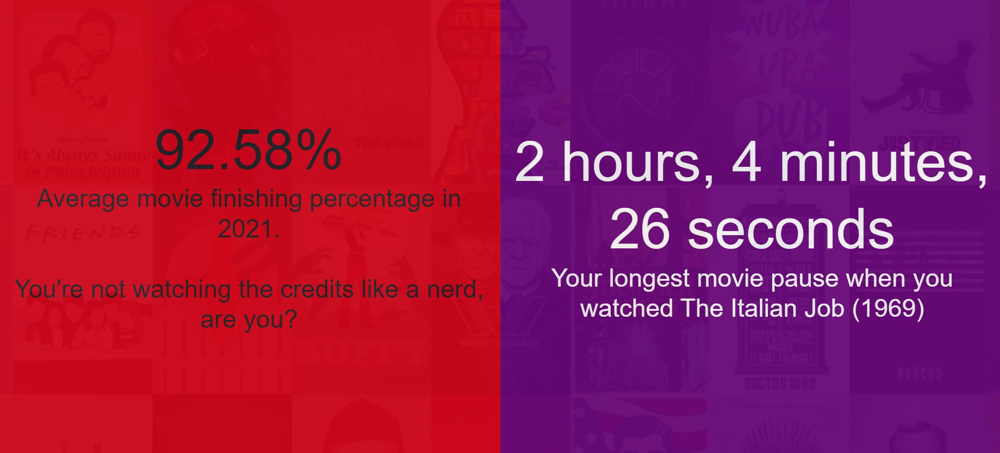

# YourPlexYear

A Spotify-Wrapped like summary for Plex.

## Deployment

This is intended to be deployed alongside [PlexSSO](https://github.com/drkno/PlexSSOv2) and Tautulli in Docker behind nginx. It isn't currently the easiest to configure or deploy, but contributions are welcome.

To configure, perform the following steps:

1. Create a docker-compose file similar to [the example file here](./example/docker-compose.yml).
2. Create the configuration directories specified within the compose file.
3. Configure [PlexSSO](https://github.com/drkno/PlexSSOv2) using the documentation in its readme.
4. Configure nginx. See [examples here](https://github.com/drkno/media-scripts).
5. Comment out the `yourplexyear` section in your compose file, and run `docker-compose up -d` once.
6. Once docker-compose has started, copy the `*.key` file from the PlexSSO configuration folder into the YourPlexYear configuration folder.
7. Add a configuration file for YourPlexYear similar to [the example here](./example/config.json).
8. Uncomment the `yourplexyear` section in your compose file, and run `docker-compose up -d` again.

## Screenshots

